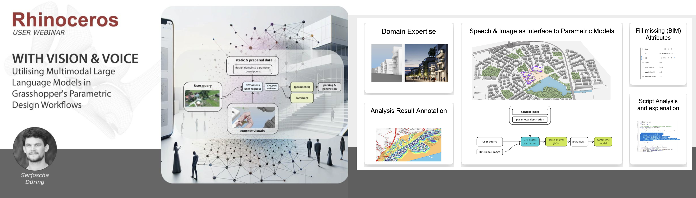
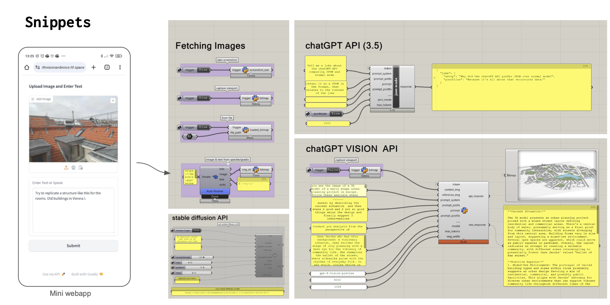
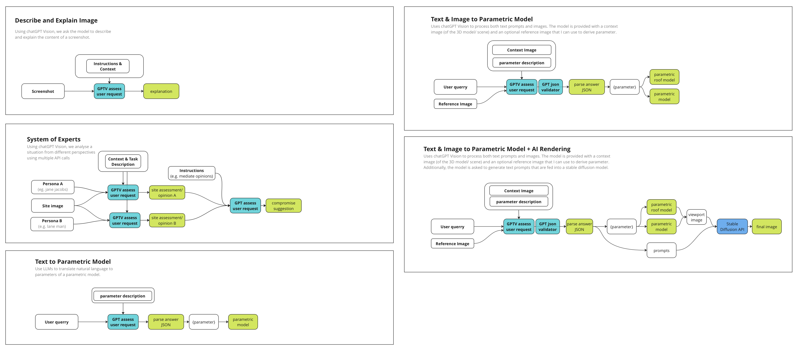

# Integration of LLMs in Grasshopper Workflows

## Introduction
Linked to a [McNeel/Rhino user webinar](https://www.youtube.com/watch?v=tbUTjJROhNc), this repository explores the integration possibilities of large language models (LLMs) within Grasshopper, a platform for visual programming in architecture and design. This initiative demonstrates how LLMs, specifically ChatGPT, can be utilized for various tasks, with a focus on manipulating parametric models in Grasshopper through natural language and reference images. Showcasing a streamlined urban block model, the webinar and this repository aim to illustrate practical applications of such technologies. 

Bonus: In addition to examples combining LLMs, parametric models, and Stable Diffusion, workflows to fetch text and image from a web app (using Gradio/Hugging Face Spaces via Speckle) for Grasshopper are provided.

## Setup and Requirements

### Installation
- Rhino/Grasshopper 7
- Grasshopper Plugin [Javid](https://www.food4rhino.com/en/app/javid) (optional, for displaying bitmaps/images)

### Accounts and API Tokens
#### OpenAI / ChatGPT
To create an OpenAI API key, follow these steps and refer to the linked resources for guidance:

1. Visit [OpenAI](https://platform.openai.com) and sign up or log in.
2. Navigate to the API section and follow the instructions to generate an API key.
3. For a detailed tutorial on how to do this, check out this [OpenAI API Key Tutorial](https://www.youtube.com/watch?v=FgjdC07qgUc).
4. In Grasshopper, paste the key/token into a panel and connect it to the script components calling the ChatGPT API.

#### Replicate Account and API Token (optional, for Stable Diffusion) 
For the text/img2img generation snippet, we are using Stable Diffusion through an API hosted on Replicate.com.
1. Go to [Replicate](https://replicate.com) and create an account.
2. Retrieve your [API token](https://docs.mindmac.app/how-to.../add-api-key/create-replicate-api-key) (may require a credit card).
3. In Grasshopper, paste the token into a panel and connect it to the Stable Diffusion component.

#### Speckle and Huggingface (optional, for the web app workflow)
In case you want to use your phone as an input device for text and image, you can use a simple Gradio web app (hosted on Hugging Face Spaces) and Speckle (it's a bit hacky) to forward input from the web app to Grasshopper.

**Speckle**
1. Install Speckle and its Grasshopper connector.
2. Create a Speckle account (on their website).
3. Create a new Speckle stream, and a new Speckle branch. Name them as you like (on their website/web app).
4. Copy the URL to the Speckle branch and paste it into a panel in Grasshopper.
5. Extract the branch name and stream ID from the URL (you will need those in the Huggingface part).
6. Create a Speckle Token (with write permission), [look here](https://speckle.guide/dev/tokens.html#) for instructions, and save the token somewhere.

**Huggingface**
1. Create an account on [Huggingface](https://huggingface.co).
2. [Duplicate](https://huggingface.co/docs/hub/spaces-overview#duplicating-a-space) [this space](https://huggingface.co/spaces/serJD/withVisionAndVoice).
3. In the duplicated space, go to settings -> Variables and secrets. There should be two variables: "SPECKLE_BRANCH" and "SPECKLE_STREAM_ID". Click on "View" for each of them, change the "Value (public)" to the respective Speckle branch name and Speckle stream ID.
4. Below, under "Secrets (private)", click on "Replace", and paste your Speckle token into the field under "Value (private)".
5. Go back to "App" and wait until the app is rebuilt. You can now access this web app from your phone's browser through the same URL.

**In Grasshopper:**
Paste the URL from your Speckle branch into a panel in Grasshopper, and connect it to the Speckle async receive component (snippet is prepared in the Grasshopper file of this repository).

#### Once you've added tokens, be careful with sharing your Grasshopper files as they now include your token.

## Getting Started

### Quick Start Guide
Make sure you have created an OpenAI account and retrieved an OpenAI API key/token (see above).
Download the Grasshopper file from this repository and open it.

### Snippets
There are several snippets prepared to capture or retrieve images, to call the ChatGPT and ChatGPT Vision API, to call the Stable Diffusion API, or to fetch data from Speckle (see image below).

For most examples, we will use a simple parametric model (see GIF below) that we will control using ChatGPT Vision. 

### Examples
In addition to the snippets, the Grasshopper file includes five examples:

#### Describe and Explain Image
Utilizes ChatGPT Vision to describe and explain the content of a screenshot, processing the user's request for an explanation based on the provided instructions and context.

#### System of Experts
Leverages ChatGPT Vision to assess a site image from the perspectives of different personas (e.g., Jane Jacobs or Ieoh Ming Pei), mediating opinions to suggest a compromise through multiple API calls.

#### Text to Parametric Model
Employs LLMs to translate a user query into parameters for a parametric model, where ChatGPT assesses the user request and the resulting JSON is parsed to define the model's parameters.

#### Text & Image to Parametric Model
Combines user queries with context and reference images to define parameters for a parametric roof model, involving ChatGPT's assessment and JSON parsing for model parameterization.

#### Text & Image to Parametric Model + AI Rendering
Integrates text and image input to drive both parametric modeling and AI rendering, where ChatGPT Vision processes the inputs, and the parameters derived are used to inform a parametric model and subsequent rendering via the Stable Diffusion API.

### Feedback and Contact
Feel free to reach out via [LinkedIn](https://www.linkedin.com/in/serjoscha-düring-920644173/) or here on GitHub.
